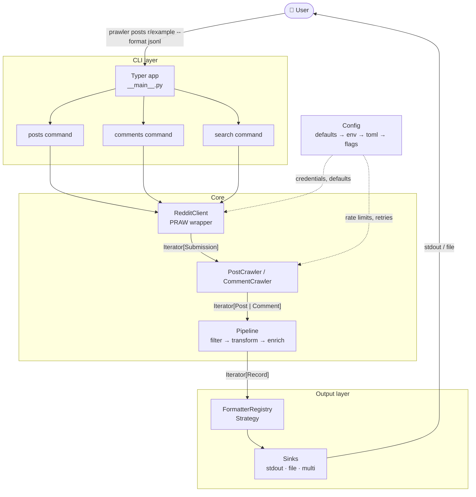
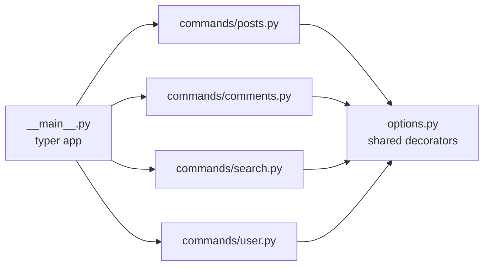
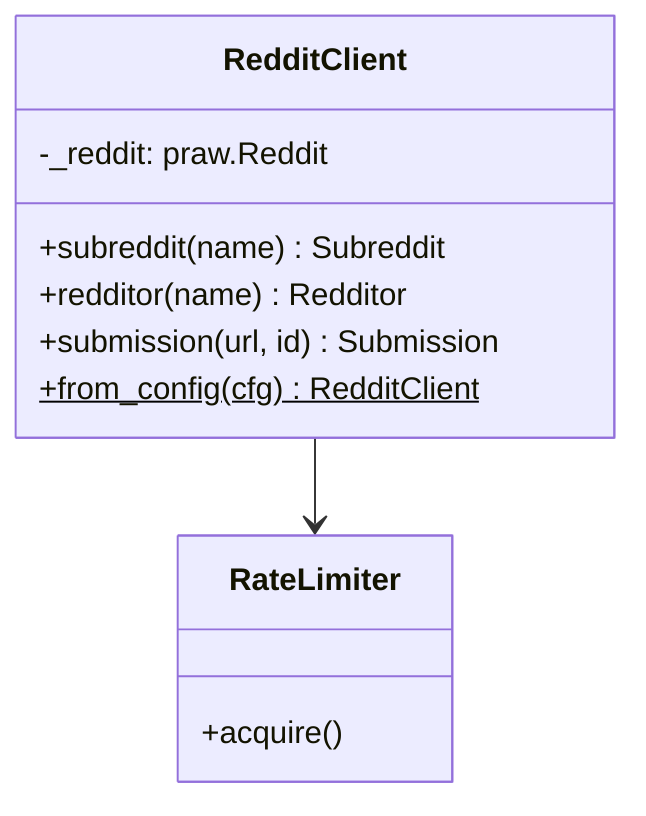
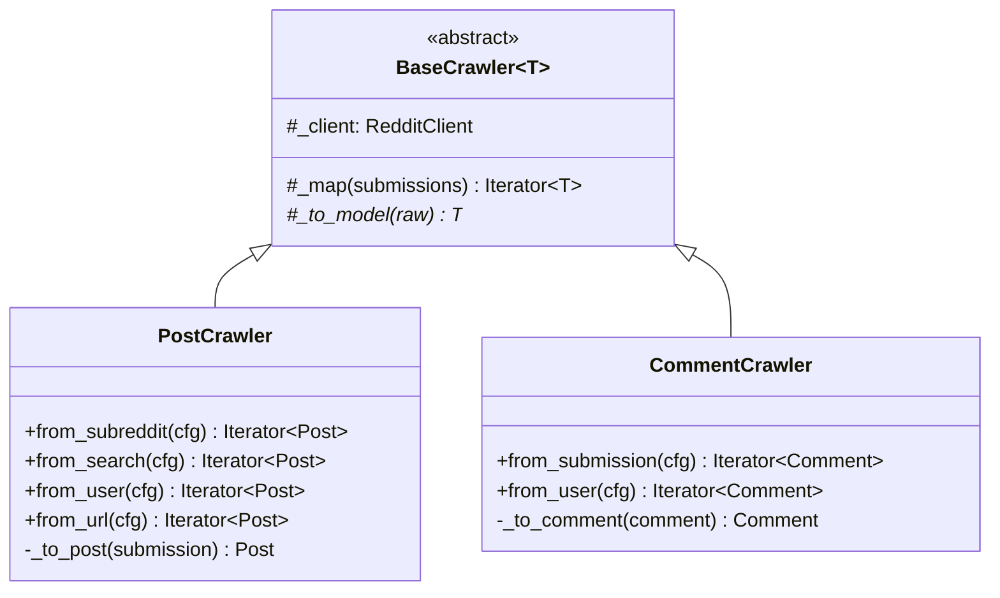
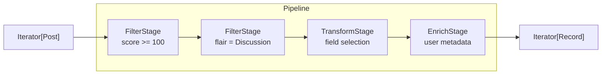
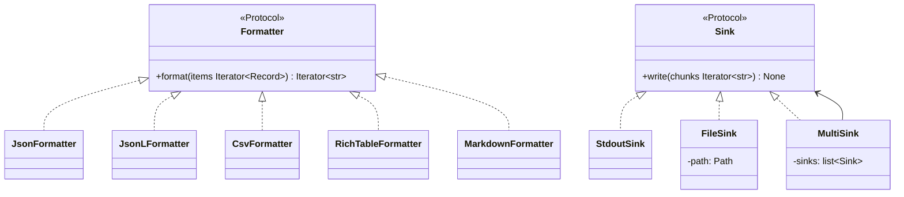
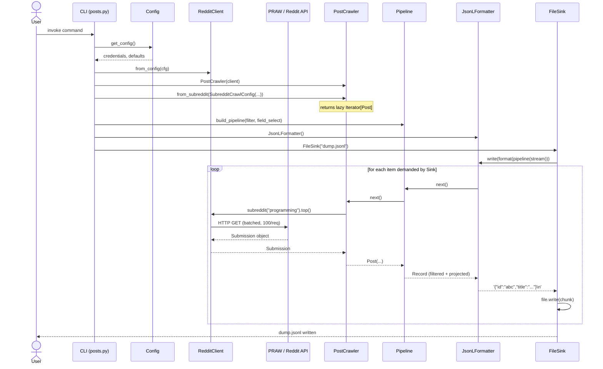
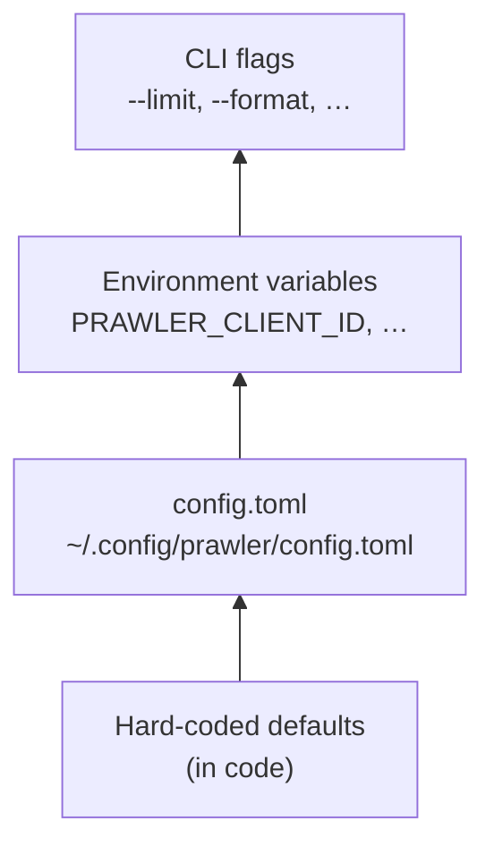

# Architecture

> **prawler** is a Reddit crawler CLI built for composability: fetch posts and comments from any source, shape data through a lazy pipeline, and emit it in any format to any destination — all from the command line.

## Table of contents

1. [Design principles](#design-principles)
2. [System overview](#system-overview)
3. [Layer breakdown](#layer-breakdown)
4. [Data flow](#data-flow)
5. [Key design patterns](#key-design-patterns)
6. [Extension points](#extension-points)
7. [Configuration](#configuration)
8. [Directory structure](#directory-structure)
9. [Dependencies](#dependencies)
10. [Decision log](#decision-log)

## Design principles

| Principle                        | Implication                                                                       |
| -------------------------------- | --------------------------------------------------------------------------------- |
| **Lazy by default**              | The entire data path is `Iterator[T]`. A 100k-post crawl uses constant memory.    |
| **Strict layer isolation**       | `praw` never leaks past `client/`. Pipeline stages are unaware of output formats. |
| **Open/closed**                  | Adding a new output format means registering one class — nothing else changes.    |
| **Credentials never in argv**    | Auth is resolved through the config layer, never passed as CLI positional args.   |
| **Fail per-item, not per-crawl** | A deleted post or suspended author logs a warning and the crawl continues.        |

## System overview



## Layer breakdown

### CLI layer — `src/prawler/cli/`

Entry point for the user. Responsible for argument parsing, help text, and wiring dependencies together. Contains **no business logic**.

Each sub-command constructs the appropriate `*CrawlConfig`, assembles pipeline stages from CLI flags, selects a formatter and sink, then connects the stream. The command function is intentionally declarative.



**Shared options** (`options.py`) define `FORMAT_OPTION`, `OUTPUT_OPTION`, `FIELDS_OPTION`, and `LIMIT_OPTION` as reusable type aliases so every command exposes a consistent interface without duplication.

### Client layer — `src/prawler/client/`

The only module allowed to import `praw`. Acts as an **anti-corruption layer**: all PRAW primitives (`praw.models.Submission`, `praw.models.Comment`) are consumed here and never escape into the rest of the codebase.



`RedditClient.from_config()` is the only factory. CLI commands never receive credentials as arguments.

Retry logic (`tenacity`) lives here, on the `submission()` method — the only call that is not already handled by PRAW's own session management.

### Crawler layer — `src/prawler/crawler/`

Maps PRAW models to domain models (`Post`, `Comment`). Each crawler exposes one method per crawl mode and returns a lazy `Iterator[DomainModel]`.



Config objects (`SubredditCrawlConfig`, `SearchCrawlConfig`, etc.) are frozen dataclasses constructed by the CLI and passed into crawlers. This keeps method signatures stable as new options are added.

**Error policy:** `_map()` wraps `_to_model()` in a `try/except` per item. Network errors that surface after the iterator is open are logged at `WARNING` level and skipped, not propagated.

### Pipeline layer — `src/prawler/pipeline/`

A chain of `PipelineStage` callables, each typed `(Iterator[T]) -> Iterator[T]`. Stages are pure transformations — they do not perform I/O and are stateless.



```python
# Composition is trivial — stages are just callables
pipeline = build_pipeline(
    make_filter_stage("score>=100"),
    make_filter_stage("flair=Discussion"),
    make_field_select_stage(["id", "title", "score"]),
)
results = pipeline(crawler.from_subreddit(cfg))
```

`build_pipeline()` reduces stages using `functools.reduce`. An empty pipeline is the identity function.

**Filter DSL** parses `--filter "score>=100"` into a typed `FilterStage`. Supported operators: `=`, `!=`, `>=`, `<=`, `>`, `<`, `~=` (regex match), `in`.

### Output layer — `src/prawler/output/`

Two orthogonal abstractions: **formatters** (serialization) and **sinks** (destination). Any formatter can be paired with any sink.



`FormatterRegistry` is a plain `dict[str, type[Formatter]]`. Registering a new format is one line.

`make_sink(output: str)` is a factory that returns `StdoutSink` when `output == "-"` and `FileSink` otherwise. Multiple `--output` flags produce a `MultiSink`.

## Data flow

End-to-end flow for `prawler posts r/<subreddt> --sort top --filter "score>=500" --fields id,title,score --format jsonl --output dump.jsonl`.



Note that **no list is ever fully materialised**: `Sink.write()` iterates chunks one at a time, which pulls through `Formatter → Pipeline → Crawler → PRAW` on demand.

## Key design patterns

### Strategy — output formatters

`Formatter` is a `Protocol`. The CLI selects an implementation at runtime via `FORMATTERS[format]()`. No `if/elif` chain anywhere in the codebase.

```python
FORMATTERS: dict[str, type[Formatter]] = {
    "json":     JsonFormatter,
    "jsonl":    JsonLFormatter,
    "csv":      CsvFormatter,
    "table":    RichTableFormatter,
    "markdown": MarkdownFormatter,
}
```

### Chain of Responsibility — pipeline stages

Each stage is `Callable[[Iterator[T]], Iterator[T]]`. Stages are composed with `build_pipeline(*stages)` and know nothing about each other.

### Factory Method — config → client

`RedditClient.from_config(cfg)` is the single authorised construction path. It extracts credentials, applies defaults, and returns a ready instance. Commands call the factory, never the constructor.

### Anti-Corruption Layer — client/

`praw` is a third-party library with its own object model. The `client/` package is the only place that depends on it. If PRAW is replaced (e.g. with direct HTTP calls for performance), only this package changes.

## Extension points

### Adding a new output format

1. Create `src/prawler/output/formatters/myformat_fmt.py` implementing `Formatter`.
2. Register it in `src/prawler/output/registry.py`:

```python
from prawler.output.formatters.myformat_fmt import MyFormatFormatter

FORMATTERS["myformat"] = MyFormatFormatter
```

Done. The CLI picks it up automatically via `--format myformat`.

### Adding a new pipeline stage

1. Create a function `make_my_stage(args) -> PipelineStage` in `pipeline/`.
2. Wire it in the command that needs it:

```python
stages.append(make_my_stage(args))
pipeline = build_pipeline(*stages)
```

### Adding a new crawl source

1. Create `src/prawler/crawler/mysource.py` with a class extending `BaseCrawler[T]`.
2. Add a new Typer sub-command in `cli/commands/`.
3. No changes required in the pipeline or output layers.

## Configuration

Configuration is resolved in layers, from lowest to highest priority:



Implemented with `pydantic-settings`. The `Config` object is constructed once per invocation and injected into `RedditClient.from_config()`.

**Sensitive fields** (`client_id`, `client_secret`, `password`) are `SecretStr` and never logged or printed.

```toml
# ~/.config/prawler/config.toml
[reddit]
client_id     = "..."
client_secret = "..."
user_agent    = "prawler/0.1 by u/yourname"

[defaults]
limit  = 100
format = "jsonl"
output = "-"
```

## Directory structure

```
src/prawler/
├── __init__.py
├── __main__.py              # python -m prawler entrypoint
│
├── cli/
│   ├── app.py               # root Typer app, registers sub-commands
│   ├── options.py           # shared option type aliases
│   └── commands/
│       ├── posts.py
│       ├── comments.py
│       ├── search.py
│       └── user.py
│
├── client/
│   ├── reddit.py            # RedditClient (only praw importer)
│   └── rate_limiter.py
│
├── crawler/
│   ├── base.py              # BaseCrawler[T] abstract class
│   ├── post.py              # PostCrawler + *CrawlConfig dataclasses
│   └── comment.py           # CommentCrawler
│
├── pipeline/
│   ├── stage.py             # PipelineStage type + build_pipeline()
│   ├── filters.py           # FilterStage + --filter DSL parser
│   ├── transforms.py        # FieldSelectStage, FlattenStage
│   └── enrich.py            # EnrichStage (lazy user metadata)
│
├── output/
│   ├── base.py              # Formatter + Sink Protocols
│   ├── registry.py          # FORMATTERS dict
│   ├── sinks.py             # StdoutSink, FileSink, MultiSink, make_sink()
│   └── formatters/
│       ├── json_fmt.py
│       ├── jsonl_fmt.py     # preferred for streaming / large crawls
│       ├── csv_fmt.py
│       ├── table_fmt.py     # Rich-powered terminal table
│       └── markdown_fmt.py
│
├── model/
│   ├── post.py              # @dataclass(frozen=True) Post
│   └── comment.py           # @dataclass(frozen=True) Comment
│
└── config.py                # Config (pydantic-settings), get_config()

tests/
├── conftest.py              # shared fixtures, mock RedditClient factory
├── test_post_crawler.py
├── test_comment_crawler.py
├── test_pipeline_filters.py
├── test_pipeline_transforms.py
└── test_output_formatters.py
```

## Dependencies

| Package             | Role                | Why not X?                                                                                                                                    |
| ------------------- | ------------------- | --------------------------------------------------------------------------------------------------------------------------------------------- |
| `typer[all]`        | CLI framework       | Wraps Click with type hints; auto-generates help and completions. Plain `argparse` is too verbose; bare `click` requires manual type mapping. |
| `praw`              | Reddit API client   | Official Python wrapper with built-in OAuth, pagination, and rate-limit backoff.                                                              |
| `tenacity`          | Retry logic         | Declarative, composable retry strategies with exponential backoff. Avoids hand-rolled loops.                                                  |
| `rich`              | Terminal formatting | Powers `RichTableFormatter` and progress indicators.                                                                                          |
| `pydantic-settings` | Config management   | Layered config (env vars + TOML + defaults) with `SecretStr` for credential fields.                                                           |

All serialization (`json`, `csv`) uses the standard library. No `pandas` — it's unnecessary overhead for a streaming pipeline and would force eager materialisation.

## Decision log

### ADR-001 — Use Typer over Click or argparse

**Context:** The CLI needs sub-commands, shared options, and auto-generated `--help`.

**Decision:** Use Typer. It provides Click's composability through Python type annotations, eliminating decorator-heavy option definitions. `typer[all]` adds `rich` integration for help formatting.

**Trade-offs:** Typer adds an indirect dependency on Click. Acceptable given it is a stable, well-maintained wrapper.

### ADR-002 — Lazy iterators throughout the pipeline

**Context:** Crawls may yield thousands of posts. Storing them in a list before filtering is wasteful.

**Decision:** Every stage — crawler, pipeline, formatter, sink — consumes and produces `Iterator[T]`. The sink's `write()` loop is the only place that "drives" the pipeline.

**Trade-offs:** Lazy iterators cannot be rewound. Any stage that needs to look ahead (e.g. sorting by score) must buffer internally and document this explicitly.

### ADR-003 — PRAW stays behind the client package boundary

**Context:** `praw.models.Submission` is a PRAW-specific type with lazy attribute loading. Leaking it into the pipeline would couple every stage to PRAW's internals.

**Decision:** `_to_post()` / `_to_comment()` are the only methods that access PRAW attributes. All downstream code receives frozen Python dataclasses.

**Trade-offs:** Adds one mapping step. Benefit: replacing PRAW requires changes only in `client/` and `crawler/`.

### ADR-004 — Formatter and Sink are Protocols, not ABCs

**Context:** Python's `Protocol` enables structural subtyping. Any class with the right methods satisfies the interface without explicit inheritance.

**Decision:** `Formatter` and `Sink` are `typing.Protocol`. Implementations do not inherit from a base class.

**Trade-offs:** Static analysis (mypy/pyright) is required to catch violations — runtime duck-typing errors are deferred to call time. This is the standard trade-off with structural typing and is acceptable for a CLI tool.

### ADR-005 — Config objects per crawl mode

**Context:** `PostCrawler` supports four distinct crawl modes (subreddit, search, user, URL), each with different valid parameters.

**Decision:** Each mode has a dedicated frozen dataclass (`SubredditCrawlConfig`, `SearchCrawlConfig`, etc.) rather than a single method with many optional parameters.

**Trade-offs:** More types to maintain. Benefit: invalid combinations (e.g. `time_filter` on a user crawl) are impossible to construct, not caught at runtime.
